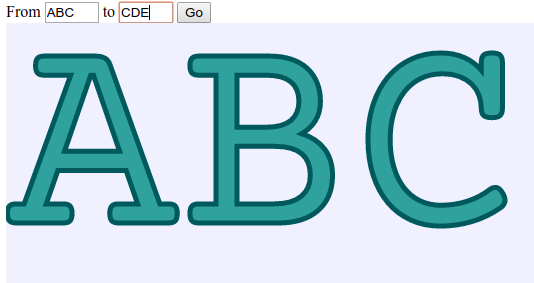
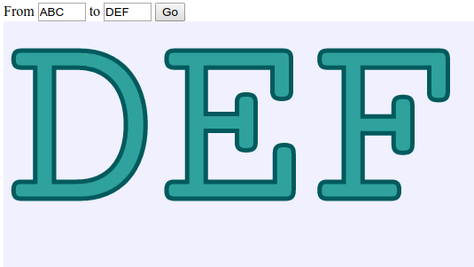

# glyph-animator
A tiny javascript (using opentype.js) for animating text glyphs.

Using SVG paths, javascript and some jquery.

See live demo at [int2byte.de](http://www.int2byte.de/public/glyph-animator "Glyph Animator Demo").
